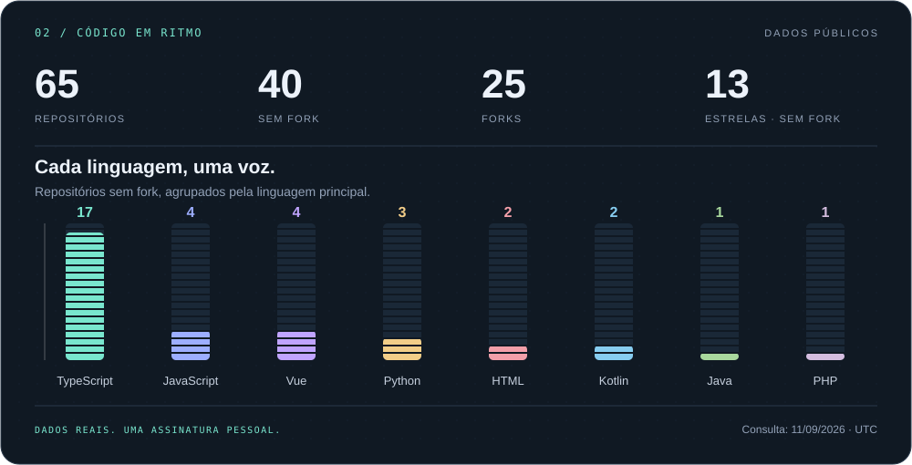

  

<h1 align="center">André Albson</h1>

  <strong>Desenvolvedor Full Stack Sênior · Interfaces, integrações e IA aplicada</strong> 
  Belo Jardim, Pernambuco · Mais de 10 anos construindo para a web

  <a href="https://www.linkedin.com/in/andrealbson/">LinkedIn</a> ·
  <a href="mailto:albsondev@outlook.com">Vamos conversar</a> ·
  <a href="https://codepen.io/albsonxavier">CodePen</a> ·
  <a href="https://github.com/albsondev?tab=repositories">Repositórios</a>

  <a href="#sobre">Sobre</a> · <a href="#projetos">Projetos</a> ·
  <a href="#experiencia">Experiência</a> · <a href="#stack">Stack</a> ·
  <a href="#github">GitHub em números</a>

---

## O cuidado com a interface. A visão do sistema inteiro.

Sou um desenvolvedor com base forte em **front-end** e atuação de ponta a ponta: da experiência de quem usa à API, aos dados e às integrações que sustentam o produto.

Minha trajetória passa por **e-commerce white-label, plataformas de atendimento, dashboards e automações**. Gosto de entender a regra de negócio, dar clareza aos fluxos e construir componentes que possam evoluir com o projeto.

Hoje também exploro **IA aplicada à engenharia de software**, usando ferramentas como Cursor e ChatGPT para apoiar investigação, implementação e documentação, com revisão técnica das entregas.

| Onde posso contribuir | O que levo para o projeto |
| :--- | :--- |
| **Interfaces e experiência** | React, Next.js e Vue; componentes reutilizáveis, responsividade e atenção aos detalhes de interação. |
| **Aplicações e integrações** | APIs, autenticação, regras de negócio e conexão entre serviços, do front-end ao banco de dados. |
| **Arquitetura e evolução** | Micro frontends, organização modular e manutenção de sistemas existentes. |
| **Automação e produtividade** | Scripts, ferramentas de IA e documentação para apoiar o trabalho da equipe. |

## Código que você pode explorar

Uma seleção de projetos e desafios técnicos públicos que mostram diferentes partes do meu trabalho.

<table>
<tr>
<td width="50%" valign="top">

### 01 · B2Blue — controle de armazenamento

**Uma regra operacional transformada em uma interface clara.**

Desafio técnico com três estações de armazenamento: ao atingir **80% de ocupação**, o sistema simula a geração de um pedido de coleta. O fluxo inclui confirmação, redefinição de volume e feedback visual.

**Em foco:** regras de negócio, estados de interface e visualização de dados simulados.

`React` `TypeScript` `Material UI`

[Explorar o código →](https://github.com/albsondev/b2blue-storage-volume-control-system)

</td>
<td width="50%" valign="top">

### 02 · WeMovies — jornada de compra

**Do catálogo à confirmação, com atenção à interação.**

Desafio de e-commerce de filmes com catálogo, carrinho, ajuste de quantidades e fluxo de checkout demonstrativo. Inclui interface responsiva e animação ao adicionar produtos ao carrinho.

**Em foco:** estado global, componentes e continuidade da experiência de compra.

`Next.js` `React` `Redux` `Tailwind CSS`

[Explorar o código →](https://github.com/albsondev/challenge-wemovies)

</td>
</tr>
<tr>
<td width="50%" valign="top">

### 03 · Gestão de clientes — micro frontends

**Três ecossistemas compondo uma aplicação.**

Desafio técnico de cadastro, edição, exclusão e seleção de clientes, estruturado com micro frontends em **Angular, Vue e React**.

**Em foco:** composição de interfaces, organização modular e integração entre frameworks.

`Angular` `Vue` `React` `TypeScript`

[Explorar o código →](https://github.com/albsondev/teste-frontend-teddy-open-finance)

</td>
<td width="50%" valign="top">

### 04 · FixFlow — controle de manutenções

**Uma visão do produto em duas camadas.**

Projeto de controle de manutenções com repositórios separados para front-end e back-end, permitindo explorar a organização de cada lado da aplicação.

**Em foco:** desenvolvimento full stack e separação de responsabilidades.

`TypeScript` `Python`

[Front-end →](https://github.com/albsondev/FixFlow-FrontEnd) · [Back-end →](https://github.com/albsondev/FixFlow-BackEnd)

</td>
</tr>
</table>

**Outras explorações:** [agendamento full stack](https://github.com/albsondev/agenda-app) · [operação florestal com Vue](https://github.com/albsondev/desafio-aiko-operacao-florestal) · [detecção corporal com Python](https://github.com/albsondev/body-detection).

## Experiência aplicada a produtos

Além dos repositórios públicos, participei de produtos e operações com necessidades distintas:

| Contexto | Minha contribuição | Entrega |
| :--- | :--- | :--- |
| **E-commerce white-label · PRECODE** | Desenvolvimento de interfaces e templates personalizáveis com Next.js e TypeScript. | Uma base de interface adaptável à identidade e às necessidades de diferentes lojas. |
| **LiveDesk · projeto para TIM** | Trabalho na experiência de uso de uma plataforma de gestão de chamados com React e Redux. | Interfaces voltadas à operação de atendimento e à organização dos chamados. |
| **Konecty · automação e organização técnica** | Scripts em Python e Shell, rotinas com Docker e documentação assistida por IA. | Automação de tarefas e estruturação de contexto técnico para o desenvolvimento. |
| **Bike-MV · web e mobile** | Desenvolvimento com Vue e abordagem PWA, priorizando a experiência em dispositivos móveis. | Uma aplicação para a comunidade de ciclismo com foco mobile first. |

<strong>Mais sobre minha trajetória</strong>

- **Konecty:** desenvolvimento full stack, automações e organização de entidades de negócio por metadados.
- **Connexa API:** desenvolvimento front-end com Next.js e integração de dados em tempo real via WebSockets.
- **PRECODE:** interfaces de e-commerce white-label e experiência de uso em sistemas de atendimento.
- **Formação:** Técnico em Informática pelo IFPE e formação em Análise e Desenvolvimento de Sistemas pela FAFICA.

[Conheça meu perfil profissional no LinkedIn →](https://www.linkedin.com/in/andrealbson/)

## Minha caixa de ferramentas

| Área | Tecnologias e práticas |
| :--- | :--- |
| **Linguagens** | JavaScript · TypeScript · PHP · Python |
| **Front-end** | React · Next.js · Vue · Angular · HTML · CSS |
| **UI e componentes** | Tailwind CSS · Storybook · Bootstrap · Material UI |
| **Back-end e integração** | Node.js · APIs REST · GraphQL · WebSockets |
| **Dados e ambiente** | PostgreSQL · MySQL · MongoDB · Docker · Git |
| **Qualidade** | Jest · Cypress · revisão de código · documentação técnica |
| **Arquitetura** | Micro frontends · Module Federation · monorepos · DDD |
| **IA no desenvolvimento** | Cursor · ChatGPT · engenharia de prompts · documentação de contexto |

<strong>Como gosto de trabalhar</strong>

1. **Entender o problema.** Alinhar o fluxo, as regras e o que caracteriza uma entrega bem-feita.
2. **Organizar a solução.** Definir responsabilidades, contratos e componentes com espaço para evolução.
3. **Construir com atenção ao uso.** Considerar carregamento, erros, estados vazios e diferentes tamanhos de tela.
4. **Verificar e explicar.** Revisar, testar os fluxos relevantes e deixar contexto para quem continuar o trabalho.

## Meu código também tem ritmo

Fora do desenvolvimento, sou **tecladista**. Trouxe um pouco dessa identidade para o perfil: o painel abaixo transforma a distribuição dos meus repositórios em um equalizador visual.

  

<!-- METRICS:START -->
**65 repositórios públicos · 40 sem fork · 25 forks · 13 estrelas nos repositórios sem fork.**

Linguagem principal dos repositórios sem fork: **TypeScript 17 · JavaScript 4 · Vue 4 · Python 3 · HTML 2 · Kotlin 2 · Java 1 · PHP 1**. Outros **6** não têm linguagem principal identificada pelo GitHub.

Dados públicos consultados em 11/09/2026 (UTC). Cada repositório conta uma vez, pela linguagem principal informada pelo GitHub. Esses números não representam tempo de experiência nem nível de domínio.
<!-- METRICS:END -->

---

## Vamos construir algo que faça sentido?

Tenho interesse em **desenvolvimento full stack, front-end, evolução de produtos e integrações**, em equipes ou projetos freelance.

Se você tem um produto para construir, uma interface para melhorar ou sistemas que precisam conversar, podemos começar pelo problema.

**[Converse comigo no LinkedIn →](https://www.linkedin.com/in/andrealbson/)**  
**[albsondev@outlook.com](mailto:albsondev@outlook.com)**

De Pernambuco para a web. Com atenção ao detalhe — no código e no teclado.

